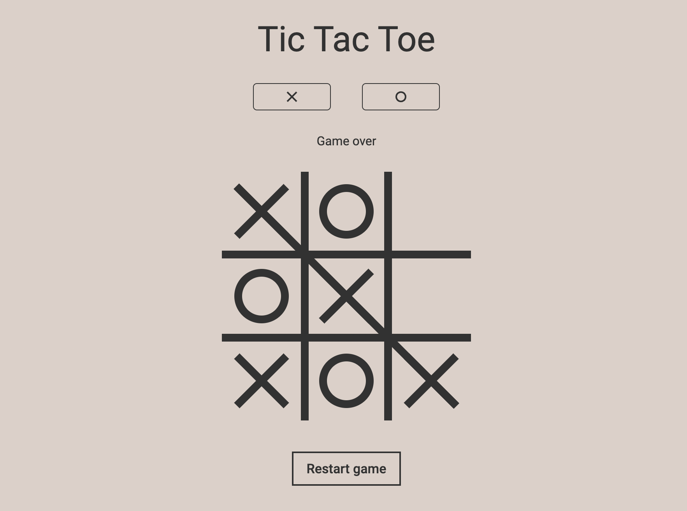

# Tic-Tac-Toe

The classic Tic-Tac-Toe game for two people.
- Application is created using React.
- Minimalistic design and interface inspired by Google's Tic-Tac-Toe game.
<!-- - State management is implemented using Redux. -->
<!-- - Database is implemented using LocalStorage. -->

<br>



## Table of Contents
- [Requirements](#requirements)
- [Installation](#installation)
- [Features](#features)
- [Project Structure](#project-structure)
- [Dependencies](#dependencies)
<!-- - [Contributing](#contributing)
- [License](#license)
- [Acknowledgments](#acknowledgments)
- [Author](#author)
- [Contact](#contact) -->

## Requirements

* [Node.js](https://nodejs.org/en)
* [Git](https://git-scm.com/)
<!-- * Node.js
* Git -->

## Installation

To install the project on your computer, follow these steps:

1. Clone the repository:
```
git clone https://github.com/ephraimbinyamin/Tic-Tac-Toe.git
```

2. Go to project folder:
```
cd Tic-Tac-Toe
```

3. Install dependencies:
```
npm install
```

4. Start the project:
```
npm start
```

## Features

-  Two player game
-  Show player turn
-  Game status message
-  Winner player screen
-  Game restart button

<!-- ## Planned Features

-  Play against AI
-  Change game difficulty. (Easy, Medium, Hard/Impossible)
-  Save changes to LocalStorage
-  Player names
-  Top Bar Menu
-  Settings Menu Button
-  Toggle Light & Dark mode
-  Player game history
-  Game time and date
-  Game timer
-  Bottom Bar Menu
-  Side Menu of game history
-  Search Bar of game history
-  Save changes to Global Database
-  User registration
-  Online game between users -->

## Project Structure

```
  .
  ├── public                  # Public assets
  ├── src                     # Source files
  │   ├── components          # React components
  │   ├── style               # General style files
  │   └── index.js            # The root file of the application
  ├── .gitignore              
  ├── package-lock.json       
  ├── package.json          
  └── README.md              
```

## Dependencies

| Package       | Version | Description                            |
|---------------|---------|----------------------------------------|
| react         | 18.2.0  | JavaScript library for building UIs    |
| react-dom     | 18.2.0  | React package for working with the DOM |
| react-scripts | 5.0.1   | Configurable scripts for React apps    |
| sass          | 1.55.0  | CSS preprocessor                       |

<!-- ## Contributing
...

## License
...

## Acknowledgments
...

## Author
...

## Contact
... -->
